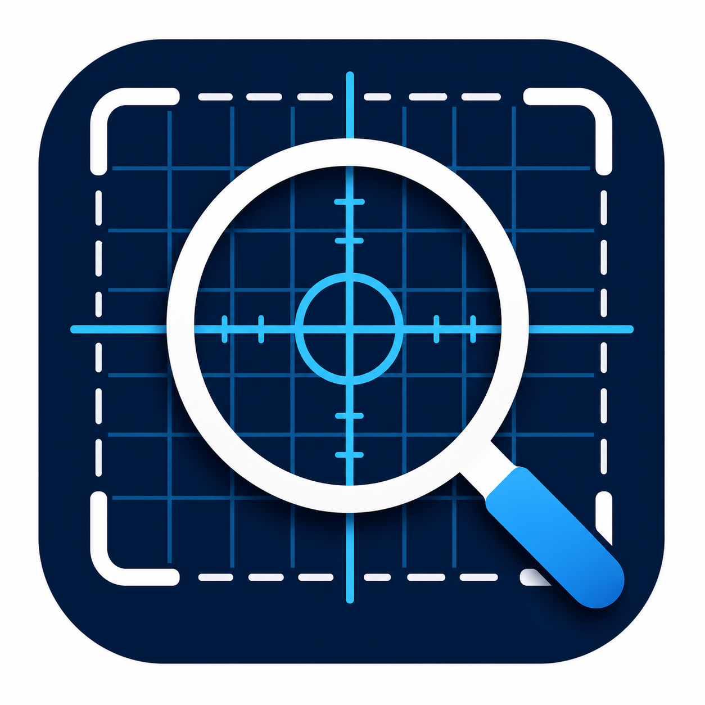
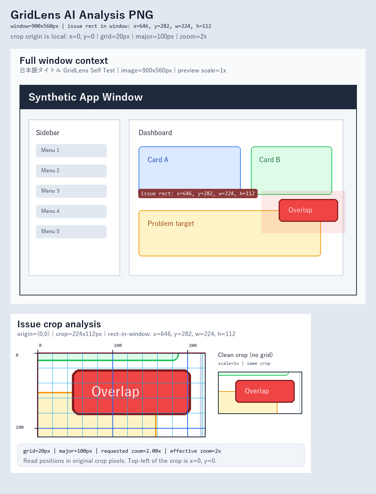

# GridLens



GridLens is a Windows screenshot tool for AI-assisted UI analysis. It captures a
selected window, lets you mark the problem area, and generates a single
AI-friendly PNG with context, grid coordinates, zoomed crop, and a clean crop.



## What It Creates

Each capture is saved in its own folder:

```text
<window name>_<YYYYMMDD>_<serial>/
  ai-analysis.png
  full.png
  issue-ai.png
  meta.json
```

- `ai-analysis.png`: the main image to upload to an AI assistant.
- `full.png`: the original selected-window screenshot.
- `issue-ai.png`: the grid/coordinate issue crop.
- `meta.json`: window size, crop rectangle, grid spacing, and output paths.

## Features

- Select a Windows window and capture it.
- Drag over the UI area you want analyzed.
- Generate a combined AI analysis PNG.
- Add crop-local coordinates, 20px grid, 100px ruler labels, and zoom metadata.
- Include a clean crop without grid lines for content recognition.
- Copy the AI analysis PNG to the clipboard after saving.
- Auto-select the window that was active just before returning to GridLens.
- Save everything locally. No network upload is performed by the app.

## Install From Source

GridLens requires Python 3.10 or newer on Windows.

```powershell
git clone https://github.com/yuuhi2010-sap/GridLens.git
cd GridLens
python -m venv .venv
.\.venv\Scripts\Activate.ps1
python -m pip install -r requirements.txt
```

## Run

```powershell
.\run.ps1
```

or:

```powershell
python .\src\gridlens.py
```

## Usage

1. Start GridLens.
2. Switch to the target window.
3. Return to GridLens. The target window should be auto-selected.
4. Click `Capture Selected Window`.
5. Drag over the problem area.
6. Click `Save Analysis Set`.
7. Upload or paste `ai-analysis.png` into your AI assistant.

## Build A Windows EXE

Install build dependencies:

```powershell
python -m pip install -r requirements-build.txt
```

Build:

```powershell
.\scripts\build-windows.ps1
```

The executable is written under `dist/GridLens/`.

## Self-Test

```powershell
python .\src\gridlens.py --self-test
```

## Privacy

GridLens does not upload screenshots. Captures are saved only to the local save
folder you choose.

Be careful when capturing screens that contain secrets, private messages,
access tokens, customer data, or other sensitive information.

## Known Limitations

- Some protected, elevated, DRM, game, or GPU-rendered windows may not capture
  correctly.
- Multi-monitor and non-100% display scaling are supported on a best-effort
  basis and should be tested on your setup.
- The crop coordinates are relative to the captured window image, not global
  desktop coordinates.

## Development

Useful checks:

```powershell
python -m py_compile .\src\gridlens.py .\GridLens.pyw
python .\src\gridlens.py --self-test
```

## License

MIT License. See [LICENSE](LICENSE).
